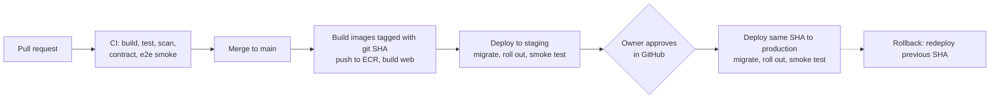

# Deployment and operations

**Status:** Draft v0.1 | **Date:** 2026-09-19 | Decision: ADR-0006. Cost model: see the plan document (about $55 to $65 a month at launch on the recommended AWS setup).

## Environments

| Environment | Purpose | Where | Notes |
| --- | --- | --- | --- |
| Local | Development | Developer machine, `docker compose` for PostgreSQL and Mailpit | `make dev`; API on 8080, Vite on 5173 proxying `/api` |
| Staging | Pre-production checks, demos to volunteers | AWS, small, same shape as production | ECS tasks scaled to zero and database stopped outside working hours to save cost |
| Production | Live | AWS, `eu-west-2` (London) unless OQ-01 says otherwise | Deployed only from a tagged main build after approval |

Recommended: separate AWS accounts for staging and production under AWS Organizations. Starting with one account and clear naming is acceptable if it is split before public launch.

## Delivery pipeline

GitHub Actions workflows:

| Workflow | Trigger | Jobs |
| --- | --- | --- |
| `ci.yml` | Pull request | Backend (build, unit and integration tests with Testcontainers, JaCoCo gate); web (lint, typecheck, unit tests, build); contract diff and client regeneration check; e2e smoke on docker compose; security (gitleaks, dependency audit, CodeQL, Trivy); Terraform `fmt`, `validate`, `tflint`, plan when `infra/` changes |
| `deploy-staging.yml` | Push to `main` | Build and push API image to ECR; build web and sync to S3 with CloudFront invalidation; run migration task; update ECS service; wait for healthy; smoke test |
| `deploy-prod.yml` | Manual, protected GitHub environment with required reviewer | Promote the exact image and web build already proven on staging; same steps |
| `nightly.yml` | Schedule | Full e2e, k6 performance smoke, PIT mutation testing, ZAP baseline, Trivy re-scan |

Note: required reviewers on a GitHub environment are not available for private repositories on the free GitHub plan. Either use a paid plan, or make `deploy-prod.yml` a manual `workflow_dispatch` that only the owner can run, with branch protection on `main`.

Principles: build once, deploy the same artefact everywhere; GitHub authenticates to AWS with OIDC and short-lived role credentials (no stored AWS keys); production deploys need a human approval; every deploy is traceable to a commit SHA.

## Database migrations

- Flyway, forward-only. Migrations run as a one-off ECS task (the same image, profile `migrate`) before the service update, so application start does not race on schema changes.
- Backwards-compatible in two steps (expand, then contract) so the previous version keeps working during a rollout and a rollback is safe.
- A snapshot is taken automatically before each production migration.
- CI applies all migrations to an empty database and to a database seeded with the previous release's schema.

## Infrastructure as code (Terraform, `infra/terraform`)

Modules: `network`, `ecr`, `ecs-service`, `alb`, `rds`, `web-hosting` (S3, CloudFront, ACM), `dns` (Route 53), `email` (SES identity, DKIM, SPF, DMARC), `secrets`, `observability`, `github-oidc`, `budgets`. Remote state in S3 with locking. `terraform apply` for production runs only in the pipeline after approval; the AI agent has no production credentials.

Cost-conscious choices at launch: API tasks in public subnets with security groups allowing only the load balancer (avoids a NAT gateway); the database in private subnets; one API task minimum, two maximum with target-tracking autoscaling; log retention 30 days; AWS Budgets alert at $80 a month.

## Runtime configuration

| Variable | Purpose |
| --- | --- |
| `SPRING_PROFILES_ACTIVE` | `local`, `staging`, `prod` |
| `DB_URL`, `DB_USER`, `DB_PASSWORD` | Database (password from Secrets Manager) |
| `APP_BASE_URL` | Links in emails |
| `CLUB_TIMEZONE` | Default for `club.timezone` on first start |
| `MAIL_FROM`, `AWS_REGION` | Email sending |
| `COVERS_BUCKET`, `COVERS_BASE_URL` | Cover storage and CDN |

Business rules are settings in the database, not variables (FR-ADM-01).

## Observability

- Health: `/actuator/health/liveness` and `/readiness` (not exposed publicly); ALB health check on readiness.
- Logs: structured JSON to CloudWatch Logs with `traceId` on every line; no personal data.
- Metrics: Micrometer to CloudWatch (request rate, latency, errors, JVM, job runs, outbox depth).
- Alarms (email and phone push to the owner):

| Alarm | Condition |
| --- | --- |
| Errors | ALB 5xx above 5 in 5 minutes |
| Health | No healthy targets for 2 minutes |
| Latency | API p95 above 1 second for 10 minutes |
| Database | CPU above 80% for 15 minutes; free storage below 20%; connections above 80% of max |
| Jobs | Hold expiry or outbox job has not succeeded in 15 minutes |
| Email | Any outbox row FAILED; SES bounce rate above 5% or complaint rate above 0.1% |
| Uptime | External check on the home page and `/api/v1/titles` every minute |
| Cost | Monthly forecast above budget |

## Backup and recovery

- RDS automated backups with point-in-time recovery, 14 days retention; deletion protection on.
- Weekly logical dump copied to a second region.
- Targets: data loss at most 5 minutes, restore within 4 hours (NFR-10).
- Restore drill before launch and quarterly: restore to a new instance, run smoke tests, record the time taken.

## Runbooks (to be written in `docs/runbooks/` as the system takes shape)

Deploy and rollback; restore the database; rotate secrets; add or remove a volunteer; SES deliverability problem; certificate or DNS problem; incident checklist and breach response; monthly maintenance (30 minutes: dashboard review, dependency updates).

## Release and versioning

Calendar versions (`v2026.10.0`), tagged on `main` when promoted to production; a short `CHANGELOG.md` for user-visible changes; hotfixes are normal PRs through the same pipeline with a shortened review.
