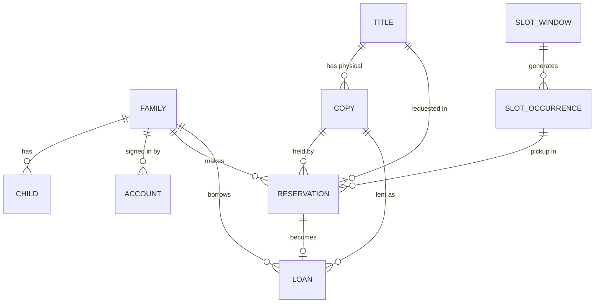
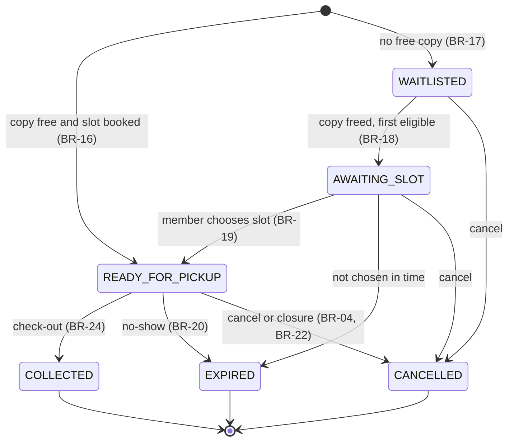
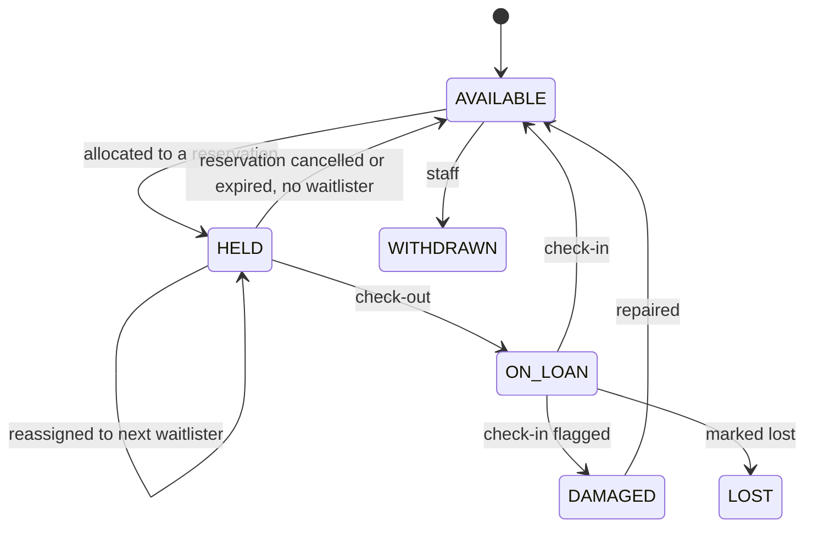

# Domain model

**Status:** Draft v0.1 | **Date:** 2026-09-19 | Rules referenced: `docs/product/business-rules.md`

## Entity relationships

## Tables and key columns

All tables also have `id` (UUID), `created_at`, `updated_at`; user-editable aggregates have `version` (optimistic locking). Names are snake_case. Types below are guidance for the Flyway migrations.

| Table | Key columns | Notes |
| --- | --- | --- |
| `account` | `email` (case-insensitive unique), `password_hash`, `role` (MEMBER, VOLUNTEER, ADMIN), `family_id` (null for staff), `email_verified_at`, `status`, `consent_version`, `consent_at` | Staff accounts have no family |
| `family` | `display_name`, `phone` (optional), `flagged_at` | One primary member account in release 1 |
| `child` | `family_id`, `first_name`, `age_band` | No other personal fields (BR-30) |
| `verification_token` | `account_id`, `type` (EMAIL_VERIFY, PASSWORD_RESET, STAFF_INVITE), `token_hash`, `expires_at`, `used_at` | Store only a hash of the token |
| `title` | `isbn13` (unique, nullable), `title`, `authors` (text[]), `description`, `publisher`, `published_year`, `language`, `age_bands` (text[]), `cover_key`, `search_vector` (tsvector) | GIN index on `search_vector`; trigram index on title and authors |
| `category`, `title_category` | name, slug; join table | |
| `copy` | `title_id`, `barcode` (unique), `status`, `condition`, `notes` | Statuses: AVAILABLE, HELD, ON_LOAN, LOST, DAMAGED, WITHDRAWN |
| `slot_window` | `weekday` (1 to 7), `start_time`, `end_time`, `capacity`, `active` | No overlap per weekday |
| `closure` | `date` (unique), `reason` | |
| `slot_occurrence` | `window_id`, `date`, `start_at`, `end_at` (UTC), `capacity`, `booked_count` | Unique on (`window_id`, `date`); generated for the booking horizon |
| `reservation` | `family_id`, `title_id`, `copy_id` (null while WAITLISTED), `pickup_slot_id` (null unless READY_FOR_PICKUP), `status`, `requested_at`, `promoted_at`, `choose_slot_by`, `idempotency_key`, `created_by` | Statuses below |
| `loan` | `reservation_id`, `copy_id`, `title_id`, `family_id`, `checked_out_at`, `due_date`, `returned_at`, `renewals`, `status` (ON_LOAN, RETURNED, LOST), `checked_out_by`, `checked_in_by` | `title_id` is denormalised to enforce one loan per family per title |
| `notification_outbox` | `type`, `recipient_account_id`, `payload` (jsonb), `dedupe_key` (unique), `status`, `attempts`, `next_attempt_at`, `sent_at` | Written in the business transaction |
| `audit_log` | `actor_account_id`, `action`, `entity_type`, `entity_id`, `details` (jsonb), `at` | No personal data in `details` |
| `setting` | `key` (unique), `value`, `updated_by` | Business rule settings |
| `shedlock` | ShedLock standard table | Job locks |

## Database-enforced invariants

These are the safety net under the application logic. Each has a test that tries to violate it.

| ID | Invariant | Mechanism |
| --- | --- | --- |
| DB-01 | A copy has at most one active hold | Unique partial index on `reservation(copy_id)` where status in (AWAITING_SLOT, READY_FOR_PICKUP) |
| DB-02 | A copy has at most one open loan | Unique partial index on `loan(copy_id)` where status = ON_LOAN |
| DB-03 | A family has at most one active reservation per title | Unique partial index on `reservation(family_id, title_id)` where status in (WAITLISTED, AWAITING_SLOT, READY_FOR_PICKUP) |
| DB-04 | A family has at most one open loan per title | Unique partial index on `loan(family_id, title_id)` where status = ON_LOAN |
| DB-05 | Slots never exceed capacity | Check `booked_count between 0 and capacity` on `slot_occurrence`, changed only under a row lock |
| DB-06 | READY_FOR_PICKUP always has a copy and a slot; WAITLISTED never has a copy | Check constraint on `reservation` |
| DB-07 | Windows do not overlap on a weekday | Exclusion constraint on minute ranges (needs `btree_gist`) |
| DB-08 | One closure per date; one occurrence per window per date | Unique constraints |
| DB-09 | An email or reminder is never queued twice | Unique `dedupe_key` on `notification_outbox` |
| DB-10 | Waitlist is ordered and fast to read | Index on `reservation(title_id, requested_at)` where status = WAITLISTED |

## State machines

Reservation:

Copy:

Loan: `ON_LOAN` to `RETURNED` (check-in) or `LOST`. Overdue is derived: `status = ON_LOAN and club-local today > due_date` (BR-10).

## Concurrency design (reserve, cancel, promote)

Goal: correct under concurrent requests on multiple API instances, without distributed locks.

Reserve (one transaction):

1. Look up `idempotency_key` for this family; if found, return the stored reservation.
2. Lock the family row (`FOR UPDATE`) and check limits (BR-12, BR-13, BR-14).
3. If a slot is supplied: lock its `slot_occurrence` row (`FOR UPDATE`), check bookable (FR-SCH-03) and `booked_count < capacity`.
4. Pick a copy: `SELECT ... WHERE title_id = ? AND status = 'AVAILABLE' ORDER BY barcode LIMIT 1 FOR UPDATE SKIP LOCKED`.
5. Copy found: set HELD, insert reservation READY_FOR_PICKUP, `booked_count + 1`, insert outbox row. No copy found: insert WAITLISTED, insert outbox row.

Always lock in the same order (family, slot occurrence, copy) to avoid deadlocks. The partial unique indexes (DB-01, DB-03) are the backstop if application logic is wrong.

Promote (on `CopyBecameAvailable`, same transaction as the release): select waitlisted reservations for the title in order with `FOR UPDATE SKIP LOCKED`, skip ineligible families, take the first eligible, set AWAITING_SLOT, mark the copy HELD, set `choose_slot_by`, insert outbox row. If none, the copy stays AVAILABLE.

Cancel and expire: reverse the changes (decrement `booked_count` under the slot lock, release the copy, then promote). Expiry jobs process rows in small batches with `FOR UPDATE SKIP LOCKED` and are safe to run twice.

Required tests: many threads reserving the last copy (exactly one READY_FOR_PICKUP, the rest WAITLISTED); many threads booking the last slot place (exactly one succeeds); check-in and cancel racing on the same copy; duplicate `Idempotency-Key`.

## Slot occurrences

A daily job (and each window or closure change) materialises occurrences for today through today plus the booking horizon (BR-05), skipping closure dates. Regeneration is idempotent on (`window_id`, `date`). Changing a window's capacity or time updates future occurrences that have no bookings; those with bookings follow FR-SCH-01 rules.
