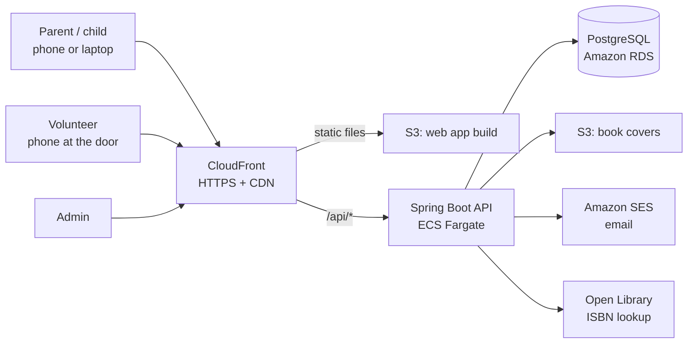
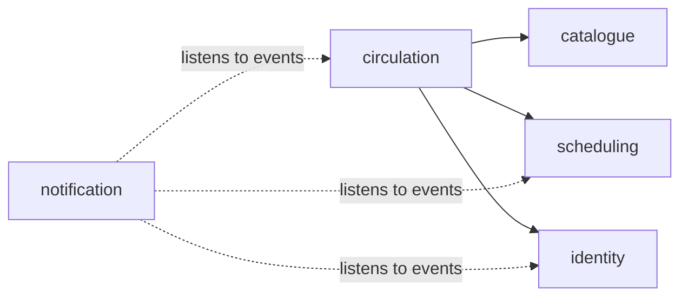
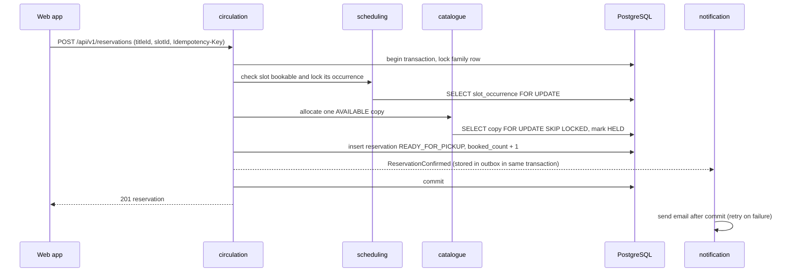

# Architecture overview

**Status:** Draft v0.1 | **Date:** 2026-09-19 | Decisions behind this page: `docs/adr/`

## Shape

A React single-page app and one Spring Boot API (a modular monolith) backed by one PostgreSQL database, deployed as containers on AWS. Modules are separated by enforced boundaries so any of them can later become its own service if metrics justify it (ADR-0002).

## System context



Browser and API share one origin (`https://<domain>` and `https://<domain>/api`), so the session cookie is first-party and there is no CORS surface in production.

## Backend modules

| Module | Responsibility | Owns tables | Publishes events | Uses (public API only) |
| --- | --- | --- | --- | --- |
| `identity` | Accounts, families, children, login, sessions, tokens, roles, invitations | account, family, child, verification_token | `FamilyRegistered`, `EmailVerificationRequested`, `PasswordResetRequested`, `StaffInvited` | none |
| `catalogue` | Titles, copies, categories, ISBN lookup, search, covers, CSV import | title, copy, category, title_category | `CopyBecameAvailable` (when status changes to AVAILABLE) | none |
| `scheduling` | Handover windows, closures, slot occurrences, availability | slot_window, closure, slot_occurrence | `ClosureCreated` | none |
| `circulation` | Reservations, waitlist, promotion, holds, expiry, loans, renewals, overdue | reservation, loan | `ReservationConfirmed`, `ReservationPromoted`, `ReservationCancelled`, `ReservationExpired`, `LoanCreated`, `LoanReturned`, `LoanRenewed` | `catalogue` (copies), `scheduling` (slots), `identity` (family), `shared` |
| `notification` | Outbox, templates, email delivery, scheduled reminders | notification_outbox | none | consumes events from all modules; reads `circulation` read models for reminders |
| `shared` | Clock, IDs, error model, settings, audit log, security helpers | setting, audit_log, shedlock | none | none |

Dependency direction (arrows mean "may call the public API of"):



Rules:

1. Only `circulation` calls other domain modules. `identity`, `catalogue` and `scheduling` depend on nothing but `shared`.
2. Nothing depends on `notification`; it reacts to events.
3. A module's public API is the classes in its root package (services, DTO records, events). Everything under `internal` is private.
4. Tests fail the build on any cycle or on access to another module's `internal` (Spring Modulith `verify()` and ArchUnit).
5. The `closures` reaction (cancel bookings) is implemented in `circulation` by listening to `ClosureCreated`.

## Backend package layout

```
com.curiouskids.club
├── ClubApplication
├── shared/                      public: Clock, Ids, ApiError, Settings, AuditLog
├── identity/                    public: FamilyApi, AccountApi, events, DTOs
│   └── internal/
│       ├── web/                 controllers
│       ├── domain/              entities, domain services, rules
│       ├── persistence/         repositories
│       └── security/            Spring Security configuration
├── catalogue/                   (same shape)
├── scheduling/                  (same shape)
├── circulation/                 (same shape)
└── notification/
    └── internal/
        ├── outbox/  email/  templates/  reminders/
```

Resources: `db/migration` (Flyway), `templates/email` (Thymeleaf or equivalent), `application.yml` plus `application-{local,test,staging,prod}.yml`. Configuration under one prefix, `club.*`.

## Reserve flow (the critical path)



If no copy is free, the same transaction inserts a WAITLISTED reservation instead and skips the slot lock. Details and constraints: `domain-model.md`.

## Cross-cutting design

| Concern | Decision |
| --- | --- |
| Time | Inject `Clock`. Store UTC. Slot logic uses `club.timezone`. Tests fix the clock. |
| IDs | UUID v7 (time-ordered) generated in the application. |
| Transactions | One transaction per use case in a module service. Cross-module reactions use events; events that must not be lost go through the outbox or Modulith's event publication registry. |
| Scheduled jobs | Idempotent, run in every instance, guarded by ShedLock (PostgreSQL) so only one runs at a time. Jobs: slot occurrence generation (daily), hold expiry (every 5 minutes), reminder scheduling (every 15 minutes), outbox sender (every 30 seconds), token cleanup (daily). |
| Configuration | Environment variables for infrastructure and secrets; the `setting` table for business rules (cached, refreshed on change). |
| Errors | RFC 9457 problem+json with a stable `code`; see `api-conventions.md`. |
| Logging | Structured JSON, correlation ID per request, no personal data. |
| Search | PostgreSQL full-text search plus `pg_trgm` for typo tolerance. No separate search engine at this scale. |
| Files | Covers stored in S3 (or referenced from Open Library on first release), served through CloudFront. |

## Frontend structure (apps/web)

```
src/
├── main.tsx  App.tsx  routes.tsx
├── api/                  generated client from contracts/openapi.yaml (do not edit)
├── features/
│   ├── auth/  catalogue/  reservations/  account/
│   ├── volunteer/        pick list, scan, overdue
│   └── admin/            windows, closures, settings, users, audit
├── components/ui/        accessible primitives (Tailwind + Radix)
├── lib/                  query client, i18n, date helpers (club timezone), scanner
└── test/                 setup, MSW handlers, fixtures
```

Conventions: TypeScript strict; TanStack Query for server state (no global store for it); React Router with route-level code splitting; React Hook Form with Zod for forms; react-i18next for all text; mobile-first layouts; barcode scanning through the browser camera (with `@zxing/browser` fallback) and USB scanners that type into a focused field; error boundaries per route; no tokens or user data in `localStorage`.

Route map: `/` home, `/books`, `/books/:id`, `/register`, `/login`, `/verify-email`, `/reset-password`, `/account`, `/account/children`, `/my/reservations`, `/my/loans`, `/staff/pick-list`, `/staff/scan`, `/staff/overdue`, `/staff/titles`, `/admin/windows`, `/admin/closures`, `/admin/settings`, `/admin/users`, `/admin/audit`.

## Scaling path

| Stage | Change |
| --- | --- |
| Launch | 1 API task, 1 small database, single availability zone |
| Growth | Same; nightly backup restore verified; add indexes driven by slow-query logs |
| Scale | 2 API tasks behind the load balancer, Multi-AZ database, cache or read replica only if metrics show need |
| Beyond | Extract a module into its own service only when an ADR shows a concrete need (independent scaling, team ownership, release cadence) |
