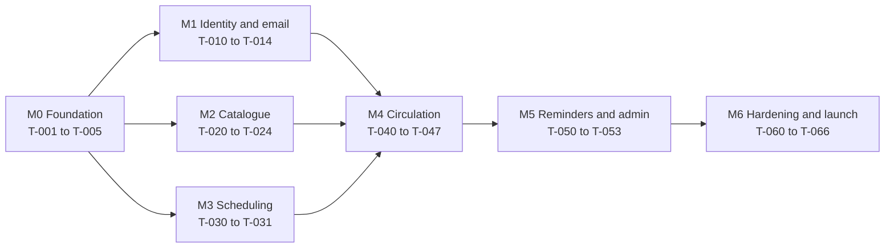

# Backlog and task cards

**Status:** Draft v0.1 | **Date:** 2026-09-19

Work is done in small vertical slices, one task per branch and pull request (`docs/00-how-we-work.md`). Near-term tasks are fully specified below. Later tasks are listed with scope and references; expand each into a card from `docs/tasks/_template.md` just before starting it, when you know what earlier tasks taught you.

**Sizes** (developer time with agent assistance, including review): S up to half a day, M one to two days, L about three days. Rough total is 50 working days (about 10 weeks) plus a 2-week pilot. Treat as plus or minus 40 percent and re-estimate after M1: React with Spring Boot is more code than the Django option in the plan, so the higher end is plausible.

## Milestones

M1, M2 and M3 can be worked in any order or in parallel worktrees once M0 is done.

## Task index

| ID | Title | Milestone | Requirements | Depends on | Size |
| --- | --- | --- | --- | --- | --- |
| T-001 | Create repo and scaffold API and web (human) | M0 | ADR-0001, ADR-0003 | none | S |
| T-002 | Repo tooling, local stack, CI | M0 | NFR-11 | T-001 | M |
| T-003 | Backend skeleton and architecture tests | M0 | NFR-03, NFR-09, NFR-11 | T-002 | M |
| T-004 | Frontend skeleton and test setup | M0 | NFR-07, NFR-08, NFR-12 | T-002, T-003 | M |
| T-005 | Walking skeleton deployed to staging | M0 | NFR-01, NFR-10 | T-003, T-004 | L |
| T-010 | Notification outbox and email sender | M1 | FR-NOT-03, FR-NOT-01 | T-003 | M |
| T-011 | Register family and verify email | M1 | FR-ID-01, FR-ID-02 | T-010 | M |
| T-012 | Login, logout, password reset, sessions, roles, rate limits | M1 | FR-ID-03, FR-ID-04 | T-011 | L |
| T-013 | Profile and child profiles | M1 | FR-ID-05, FR-ID-06 | T-012 | S |
| T-014 | Staff invitations and user administration | M1 | FR-ID-07 | T-012 | M |
| T-020 | Titles, copies, categories: staff CRUD | M2 | FR-CAT-03, FR-CAT-05, FR-CAT-07 | T-014 | M |
| T-021 | ISBN lookup adapter | M2 | FR-CAT-04 | T-020 | S |
| T-022 | Public browse, search and title detail | M2 | FR-CAT-01, FR-CAT-02 | T-020 | M |
| T-023 | CSV bulk import | M2 | FR-CAT-06 | T-020 | M |
| T-024 | Cover image storage | M2 | FR-CAT-03 | T-021 | S |
| T-030 | Handover windows and closures (admin) | M3 | FR-SCH-01, FR-SCH-02 | T-014 | M |
| T-031 | Slot occurrences, generation job, slot listing | M3 | FR-SCH-03 | T-030 | M |
| T-040 | Reserve a title with a free copy and slot | M4 | FR-RES-01, FR-RES-06 | T-013, T-020, T-031 | L |
| T-041 | Waitlist, promotion, choose slot | M4 | FR-RES-02, FR-RES-03 | T-040 | L |
| T-042 | Cancel, hold expiry, closure reaction | M4 | FR-RES-04, FR-RES-05, FR-SCH-02 | T-041 | M |
| T-043 | Pick list and check-out | M4 | FR-CIR-01, FR-CIR-02 | T-040 | M |
| T-044 | Check-in, no-show, lost or damaged | M4 | FR-CIR-03, FR-CIR-06 | T-043, T-041 | M |
| T-045 | Renewals and overdue | M4 | FR-CIR-04, FR-CIR-05 | T-043 | M |
| T-046 | My reservations and loans | M4 | FR-RES-07 | T-040 | S |
| T-047 | On-behalf actions (should) | M4 | FR-CIR-07 | T-043 | S |
| T-050 | Scheduled reminders | M5 | FR-NOT-02 | T-045, T-010 | M |
| T-051 | Settings administration | M5 | FR-ADM-01 | T-030 | M |
| T-052 | Admin dashboard | M5 | FR-ADM-02 | T-045 | S |
| T-053 | Audit log | M5 | FR-ADM-03 | T-044 | S |
| T-060 | MFA for staff | M6 | NFR-05 | T-014 | M |
| T-061 | Privacy: consent pages, export, deletion, retention | M6 | FR-ID-08, BR-37, NFR-06 | T-013 | M |
| T-062 | Full e2e suite and accessibility pass | M6 | NFR-07 | M4 | M |
| T-063 | Performance and security testing | M6 | NFR-02, NFR-05 | M4 | M |
| T-064 | Production environment, monitoring, backups, restore drill | M6 | NFR-01, NFR-09, NFR-10 | T-005 | L |
| T-065 | Pilot with 10 to 20 families, fixes | M6 | all | T-062, T-064 | calendar 2 weeks |
| T-066 | Launch and hand-over | M6 | all | T-065 | S |

---

## T-001 Create repo and scaffold API and web (human)

**You do this yourself.** Refs: `docs/adr/0001`, `0003`, README layout.

Steps:

1. Create a private GitHub repository named `curiouskids-club`. Clone it.
2. Copy this spec pack into the clone (`README.md`, `CLAUDE.md`, `docs/`, `.github/`). Commit to `main`: `docs: add spec pack`. Push.
3. Generate the API at start.spring.io:
   - Project: Maven. Language: Java. Spring Boot: latest stable 4.1.x (not a snapshot or milestone).
   - Group `com.curiouskids`, Artifact `club-api`, Name `club-api`, Package name `com.curiouskids.club`, Packaging Jar, Java 25.
   - Dependencies: Spring Web, Spring Security, Spring Data JPA, Validation, PostgreSQL Driver, Flyway Migration, Spring Boot Actuator, Spring Modulith, Java Mail Sender, Testcontainers. (Names may differ slightly in the current Initializr; pick the equivalents. Later tasks add springdoc-openapi, ArchUnit, ShedLock, Spring Session JDBC.)
   - Unzip so that `pom.xml` and `mvnw` are directly in `apps/api/`.
4. Generate the web app: from the repo root run `npm create vite@latest apps/web -- --template react-ts`, then `cd apps/web && npm install`. Use Node 24 LTS; add `.nvmrc` containing `24` and an `engines` field in `package.json`.
5. Verify: in `apps/api` run `./mvnw verify` (Docker must be running for Testcontainers); in `apps/web` run `npm run build`.
6. Commit as two commits: `chore: scaffold api (Spring Initializr)` and `chore: scaffold web (Vite react-ts)`. Push to `main` (branch protection comes in T-002).
7. Read the ADRs and the open questions. Set each ADR's status to Accepted, or edit it. Answer OQ-01 to OQ-07 in `vision-and-scope.md` where you can.

Acceptance:

- [ ] Repository exists with the layout in README (`apps/api`, `apps/web`, `docs`, `.github`).
- [ ] `./mvnw verify` and `npm run build` pass on a clean clone.
- [ ] Three commits as above on `main`.
- [ ] ADRs reviewed and marked Accepted or amended; OQ-07 (monolith or microservices) answered.

Out of scope: any feature code, Docker, CI.

---

## T-002 Repo tooling, local stack, CI

Refs: `docs/00-how-we-work.md`, `docs/architecture/testing-strategy.md`, `docs/architecture/deployment-and-operations.md`. Agent task.

Scope:

- Root `.gitignore`, `.editorconfig`, `.gitattributes`.
- `infra/local/docker-compose.yml`: PostgreSQL (latest major supported by RDS) with a named volume, Mailpit (SMTP 1025, UI 8025).
- `Makefile` with targets: `dev`, `verify`, `api-test`, `web-test`, `e2e` (placeholder until T-004), `format`, `api-client` (placeholder until T-003), `seed` (placeholder), `clean`.
- Java formatting with Spotless; ESLint and Prettier for the web app; a pre-commit hook (lefthook) running format checks and gitleaks.
- `.github/workflows/ci.yml` (backend job and web job with path filters, caching, Testcontainers), `.github/CODEOWNERS`, `.github/dependabot.yml` (Maven, npm, GitHub Actions, weekly).
- `application-local.yml` pointing at the compose database and Mailpit; Vite dev proxy for `/api` to `localhost:8080`.
- Document branch protection settings in `docs/00-how-we-work.md` if they differ (require PR, CI, review; no force-push) and apply them on GitHub.

Acceptance:

- [ ] Fresh clone, then `make dev` starts PostgreSQL, Mailpit, the API (readiness UP) and the web dev server.
- [ ] `make verify` passes locally and in CI on a pull request.
- [ ] A PR with a failing test cannot be merged; a committed fake secret is blocked by gitleaks.
- [ ] Dependabot opens its first PRs within a week.

Out of scope: Dockerfiles for deployment, Terraform, feature code.

---

## T-003 Backend skeleton and architecture tests

Refs: `docs/architecture/overview.md`, `api-conventions.md`, `domain-model.md` (settings, audit, shedlock), CLAUDE.md architecture rules.

Scope:

- Module packages `identity`, `catalogue`, `scheduling`, `circulation`, `notification`, `shared`, each with `package-info.java` declaring the module and the allowed dependencies from `overview.md`; `internal` subpackages.
- Tests: `ApplicationModules.verify()` and ArchUnit rules (controllers only in `internal.web`, no entity in a controller signature, no `Instant.now()` outside `Clock` usage).
- `shared`: `Clock` bean, UUID v7 generator, `ApiError` and a global exception handler producing RFC 9457 problem+json with `code` and `traceId`, request `traceId` filter, structured JSON logging, `Settings` service reading the `setting` table with caching, `AuditLog` service.
- Flyway `V1__baseline.sql`: `setting`, `audit_log`, `shedlock`; seed default settings from `business-rules.md`.
- `club.*` configuration properties class, including `club.timezone`.
- Testcontainers base test class (singleton container); Spring Session and Security left for T-012.
- springdoc-openapi; `contracts/openapi.yaml` created with `info` and the `ping` endpoint; a test comparing the exported spec with the contract; `make api-client` wired (used by T-004).
- `GET /api/v1/ping` returning `{ "status": "ok", "time": <instant> }` as the first contract-driven endpoint.

Acceptance:

- [ ] A temporary class in `catalogue` importing `circulation.internal` makes `make api-test` fail; removing it passes.
- [ ] Unknown route returns 404 problem+json; invalid input returns 400 with `errors`; both include `traceId`.
- [ ] Logs are JSON with `traceId`; the migration applies on an empty PostgreSQL in the test.
- [ ] Changing the controller without changing the contract fails the contract test.
- [ ] `make verify` passes; coverage gates configured (JaCoCo).

Out of scope: any business feature, authentication.

---

## T-004 Frontend skeleton and test setup

Refs: `docs/architecture/overview.md` (frontend structure and route map), `testing-strategy.md`.

Scope:

- Tailwind CSS with Radix primitives (shadcn/ui style components) in `components/ui`; kid-friendly but neutral theme tokens; dark mode not required.
- React Router with layouts (public, member, staff, admin) and stub pages for the route map; route-level code splitting.
- TanStack Query provider, generated API client from `contracts/openapi.yaml` in `src/api` (via `make api-client`), a `useApi` helper that surfaces problem+json `code`.
- `react-i18next` with an English resource file; all visible text through it. Date helpers in the club timezone.
- Error boundary per route, a global toast for unexpected errors.
- Vitest, Testing Library, MSW, jest-axe with one example test per pattern; Playwright config with a smoke test (home page loads, `ping` shows OK) wired to `make e2e`.
- ESLint with the jsx-a11y plugin; TypeScript `strict`.

Acceptance:

- [ ] `make web-test`, `make e2e` and `npm run build` pass.
- [ ] The home page renders via the generated client calling `/api/v1/ping`.
- [ ] Changing an endpoint in the contract and regenerating the client causes a TypeScript error where it is used.
- [ ] No hard-coded user-facing strings outside the i18n files (lint rule).

Out of scope: real pages, authentication.

---

## T-005 Walking skeleton deployed to staging

Refs: `docs/architecture/deployment-and-operations.md`, ADR-0006. Prerequisites you provide: an AWS account, a domain name, a GitHub repository with Actions enabled.

Scope:

- Multi-stage `Dockerfile` for the API (Temurin 25 JRE, non-root, read-only root filesystem, layered jar).
- Terraform modules: `network`, `ecr`, `ecs-service`, `alb`, `rds`, `web-hosting`, `dns`, `github-oidc`, `budgets`; remote state.
- `deploy-staging.yml`: build and push image (tag = commit SHA), migration task, ECS update, web sync and CloudFront invalidation, smoke test.
- Health checks wired; CloudWatch log group with 30-day retention; AWS Budgets alert.

Acceptance:

- [ ] Merging to `main` deploys automatically to `https://staging.<domain>`; the home page and `/api/v1/ping` work over HTTPS.
- [ ] Redeploying an older SHA works (rollback rehearsed and noted in a runbook stub).
- [ ] The pipeline uses OIDC; no AWS keys in GitHub secrets. The agent never received AWS credentials.
- [ ] Staging monthly cost estimate recorded; database not publicly reachable.

Out of scope: production environment (T-064), email (T-010 configures SES sandbox), monitoring alarms beyond health and budget.

---

## Later tasks: scope notes

Write the full card from the template just before starting each. Key notes:

| ID | Notes for the card |
| --- | --- |
| T-010 | Outbox table and dispatcher (30-second poll, `SKIP LOCKED`, backoff, 5 attempts, FAILED status); `EmailSender` port with SMTP (Mailpit) and SES adapters; template engine; `dedupe_key` uniqueness (DB-09); ShedLock on the dispatcher. |
| T-011 | Registration with consent, enumeration-safe responses, token hashing, verification page; Playwright journey step 1 partially. |
| T-012 | Spring Security config, Spring Session JDBC, CSRF, `__Host-` cookie, login rate limiting (Bucket4j or equivalent), lockout, password policy with common-password check, reset flow, role model, `GET /auth/me`, security header tests, IDOR test harness reused by later tasks. |
| T-013 | Profile edits with email re-verification; child CRUD with strict schema (no extra fields), limit of 6. |
| T-014 | Invitation tokens, admin user list, deactivate user, seed first admin from an environment variable on first start only. |
| T-020 | Title and copy entities, barcode uniqueness, status changes audited, category and age band admin; staff UI on mobile. |
| T-021 | Port and adapter for Open Library (3 s timeout, allow-listed host, caching, graceful failure); scan input works with a USB scanner and camera. |
| T-022 | PostgreSQL full-text search with trigram fallback, filters, pagination, availability counts, public caching headers; performance test with 10,000 generated titles. |
| T-023 | Dry-run validation report, idempotent import on ISBN plus barcode, size and row limits. |
| T-024 | S3 upload with validation and re-encoding, or hotlink policy decision documented as an ADR. |
| T-030 | Window CRUD with overlap exclusion constraint (DB-07), closures with affected-reservation preview (reaction implemented in T-042). |
| T-031 | Occurrence generation job (idempotent, ShedLock), slot list API with bookability computed server-side and DST-safe tests. |
| T-040 | Follow the concurrency design in `domain-model.md` exactly; multi-threaded tests; idempotency key store; the most important task to review by hand. |
| T-041 | Waitlist ordering, eligibility skipping, promotion transaction, choose-slot endpoint and page. |
| T-042 | Cancel with capacity release, expiry job in batches (`SKIP LOCKED`), reaction to `ClosureCreated`. |
| T-043 | Pick list optimised for phone use; scan check-out with override reason; idempotency. |
| T-044 | Check-in with promotion, damaged flag, no-show action, lost handling. |
| T-045 | Renewal rules, derived overdue, possible-lost queue. |
| T-050 | Reminder scheduler producing outbox rows with dedupe keys; time-based tests with a fixed clock. |
| T-051 | Validated settings screen with audit entries; cache invalidation. |
| T-060 | TOTP enrolment, recovery codes, enforce for VOLUNTEER and ADMIN. |
| T-061 | Privacy notice and terms pages with versioning, data export job, deletion and anonymisation, retention job. |
| T-062 | All six e2e journeys in `testing-strategy.md`; axe on key pages; keyboard-only run. |
| T-063 | k6 scenarios, ZAP baseline, ASVS L1 checklist review, fixes. |
| T-064 | Production Terraform, alarms, backups, restore drill recorded, runbooks written, SES production access requested. |
| T-065 | Pilot group, feedback log, fix list, go or no-go with the owner. |
| T-066 | Open registration, volunteer training and short guides, monitoring watched for two weeks. |
